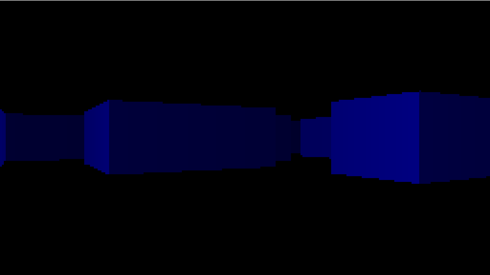

# Ray casting demo

This is a simple [ray casting](https://en.wikipedia.org/wiki/Ray_casting) demo
built on [Elm](https://elm-lang.org/). This is all based on
[this tutorial](https://lodev.org/cgtutor/raycasting.html).

You can start a development server with `yarn dev`, but hot reloading doesn't
seem to work correctly with headless Elm programs, so you'll have to reload
the page.

The code is in the public domain. Check the [LICENSE](LICENSE) file for more
details.
